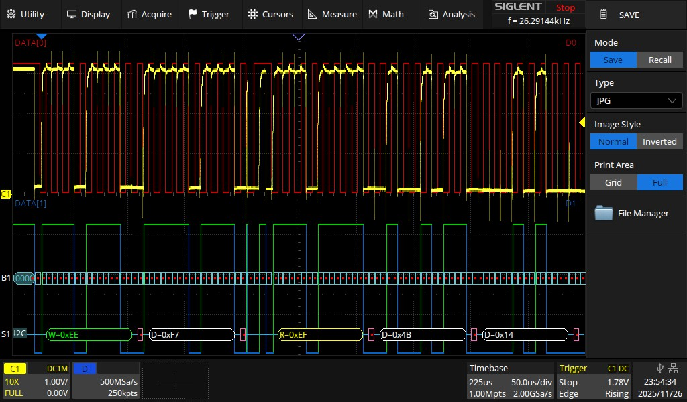
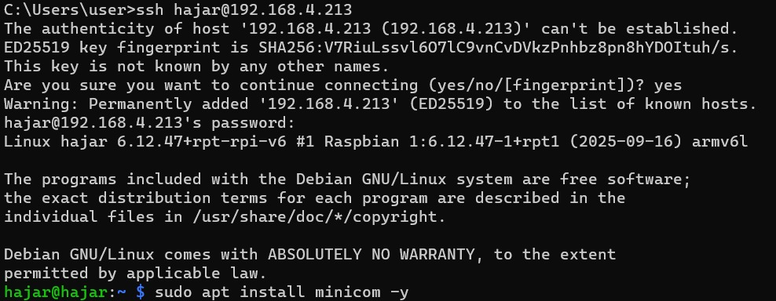
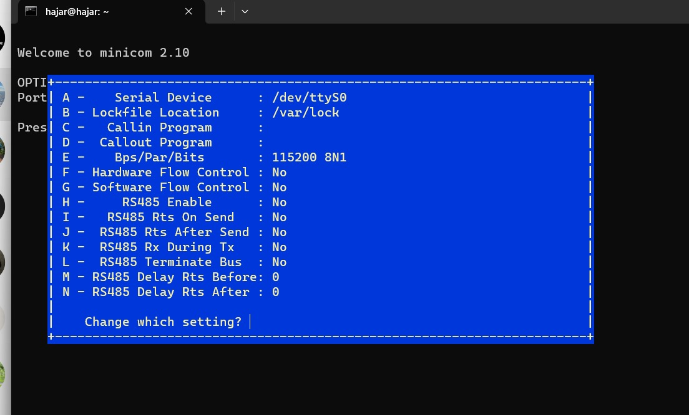
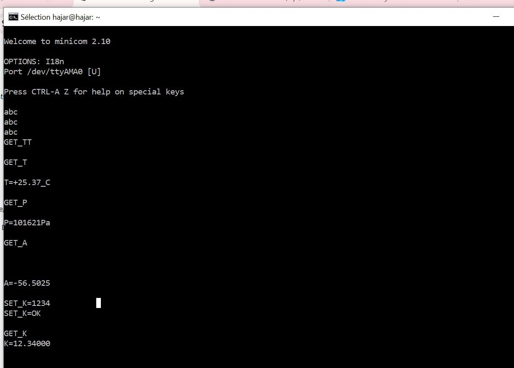
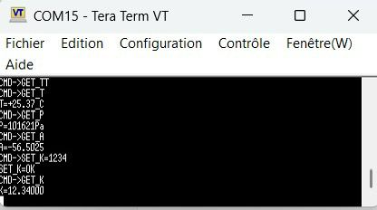
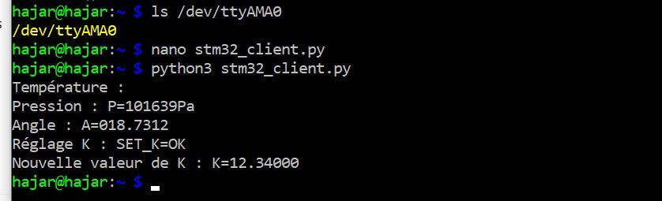
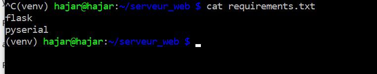
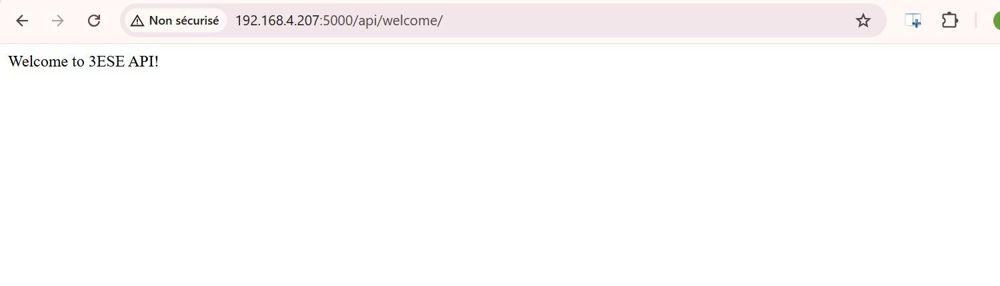
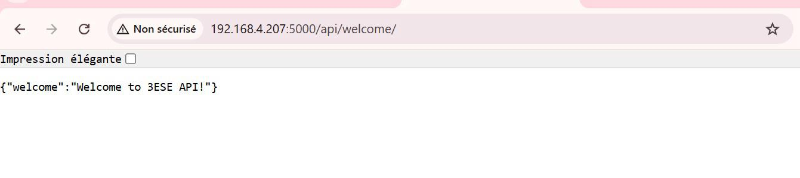
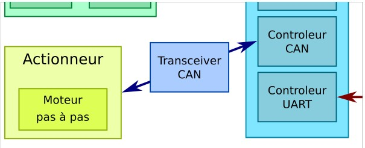

# 2526-ESE-TP_Bus-R-seau-Hajar_AIT_ALLA-Ikram_AFIF

# Réalisé par:
-Ikram AFIF

-Hajar AIT ALLA

# Objectif du TP

Ce TP a pour objectif la mise en place de l'ensemble des composants suivants:


# TP1 Capteur BMP280 (Bus I²C)

## 1. Quelles sont les adresses I²C possibles pour ce composant ?

Le BMP280 possède deux adresses I²C possibles selon le niveau logique de la broche SDO :

- `0x76` lorsque **SDO est reliée à la masse (GND)**
- `0x77` lorsque **SDO est reliée à la tension d’alimentation (VDDIO)**

---

## 2. Quel est le registre et la valeur permettant d’identifier ce composant ?

Le registre d’identification du BMP280 est :

- **Adresse du registre :** `0xD0`
- **Valeur attendue :** `0x58`

Cette valeur permet de vérifier que le capteur connecté est bien un BMP280.

---

## 3. Quel est le registre et la valeur permettant de placer le composant en mode normal ?

Le registre utilisé pour configurer le mode de fonctionnement est :

- **Nom du registre :** `ctrl_meas`
- **Adresse :** `0xF4`

Pour placer le capteur en **mode normal**.

Il faut écrire la valeur suivante :

- **Valeur :** `0x57` (`010 101 11` en binaire)

---

## 4. Quels sont les registres contenant l’étalonnage du composant ?

Les coefficients de calibration sont stockés dans les registres :

- **De l’adresse :** `0x88`
- **À l’adresse :** `0xA1`

---

## 5. Quels sont les registres contenant la température (ainsi que le format) ?

La température brute est codée sur **20 bits**, répartis sur trois registres :

| Registre   | Adresse | Bits utilisés |
|-----------|---------|---------------|
| temp_msb  | `0xFA`  | [19:12]       |
| temp_lsb  | `0xFB`  | [11:4]        |
| temp_xlsb | `0xFC`  | [3:0] (bits 7–4 du registre) |

Reconstruction de la valeur brute :

```c
adc_T = (temp_msb << 12) | (temp_lsb << 4) | (temp_xlsb >> 4);
```
## 6. Quels sont les registres contenant la pression (ainsi que le format) ?

La pression brute est codée sur **20 bits**, répartis sur trois registres :

| Registre    | Adresse | Bits utilisés |
|------------|---------|---------------|
| press_msb  | `0xF7`  | [19:12]       |
| press_lsb  | `0xF8`  | [11:4]        |
| press_xlsb | `0xF9`  | [3:0] (contenus dans les bits 7–4 du registre) |

La valeur brute de la pression est reconstruite comme suit :

```c
adc_P = (press_msb << 12) | (press_lsb << 4) | (press_xlsb >> 4);
```


## 7. les fonctions permettant le calcul de la température et de la pression compensées, en format entier 32 bits.


## Test de la chaîne de compilation et communication UART sur USB via printf


## Communication I²C
**Primitives I²C sous STM32 HAL**

Le STM32 met à disposition deux fonctions principales pour communiquer avec un périphérique I²C en mode maître :
```c
HAL_I2C_Master_Transmit(&hi2c, DevAddress, pData, Size, Timeout);
HAL_I2C_Master_Receive(&hi2c, DevAddress, pData, Size, Timeout);
```

L’adresse I²C du composant est fournie sur 7 bits dans la datasheet, mais la HAL du STM32 exige 8 bits.
Il faut donc décaler l’adresse à gauche d’un bit :
```c
#define BMP280_I2C_ADDRESS   (0x77 << 1)
```

**Communication avec le BMP280**
- Identification du BMP280
L’objectif de cette étape est de vérifier que le capteur BMP280 est bien détecté sur le bus I²C.
Pour cela, nous devons lire le registre d’identification du composant.
```c
/************* Identification du BMP280 *************/

// Lecture d'un registre générique
HAL_StatusTypeDef BMP280_ReadRegister(I2C_HandleTypeDef *hi2c, uint8_t reg, uint8_t *value)
{
    // Étape 1 : envoyer l'adresse du registre à lire
    if (HAL_I2C_Master_Transmit(hi2c, BMP280_I2C_ADDRESS, &reg, 1, HAL_MAX_DELAY) != HAL_OK)
        return HAL_ERROR;

    // Étape 2 : lire 1 octet envoyé par le capteur
    if (HAL_I2C_Master_Receive(hi2c, BMP280_I2C_ADDRESS, value, 1, HAL_MAX_DELAY) != HAL_OK)
        return HAL_ERROR;

    return HAL_OK;
}

// Lecture du registre ID (0xD0)
HAL_StatusTypeDef BMP280_ReadID(I2C_HandleTypeDef *hi2c, uint8_t *id)
{
    return BMP280_ReadRegister(hi2c, BMP280_ID_REG, id);
}

// --- Appel dans le main() ---

uint8_t id = 0;

if (BMP280_ReadID(&hi2c1, &id) == HAL_OK)
{
    printf("BMP280 ID reçu : 0x%02X\r\n", id);

    if (id == BMP280_ID_VAL)   // BMP280_ID_VAL = 0x58
    {
        printf("Capteur BMP280 détecté : OK\r\n");
    }
    else
    {
        printf("Erreur : ID incorrect !\r\n");
    }
}
else
{
    printf("Erreur I2C : impossible de lire l'ID du BMP280.\r\n");
}

```
- Vérification à l'oscilloscope que la formes des trames I²C est conforme:



- Configuration du BMP280
Avant toute mesure, le BMP280 doit être configuré dans le registre 0xF4.

```c
/************* Configuration du BMP280 *************/

// Registre de configuration du BMP280
#define BMP280_CTRL_MEAS     0xF4
// Configuration : Temp ×2, Press ×16, Mode normal
#define BMP280_CONFIG_VALUE  0x57   // 0b0101 0111

// Écriture dans un registre du BMP280
HAL_StatusTypeDef BMP280_WriteRegister(I2C_HandleTypeDef *hi2c, uint8_t reg, uint8_t value)
{
    uint8_t data[2] = { reg, value };

    // Étape 1 : envoyer adresse du registre + valeur
    if (HAL_I2C_Master_Transmit(hi2c, BMP280_I2C_ADDRESS, data, 2, HAL_MAX_DELAY) != HAL_OK)
        return HAL_ERROR;

    return HAL_OK;
}

// Fonction de configuration
HAL_StatusTypeDef BMP280_Config(I2C_HandleTypeDef *hi2c)
{
    return BMP280_WriteRegister(hi2c, BMP280_CTRL_MEAS, BMP280_CONFIG_VALUE);
}

// ----- Appel dans le main() -----

if (BMP280_Config(&hi2c1) == HAL_OK)
{
    printf("Configuration BMP280 : OK\r\n");
}
else
{
    printf("Erreur : impossible d'écrire la configuration.\r\n");
}

```


## Récupération de l'étalonnage, de la température et de la pression
Les coefficients d’étalonnage se trouvent dans les registres 0x88 à 0xA1.

Les valeurs brutes pression/température sont dans les registres 0xF7 à 0xFC (20 bits chacune).


## Calcul des températures et des pression compensées
Le BMP280 fournit des formules en entier 32 bits pour calculer les valeurs compensées.
Nous avons repris exactement les équations de la datasheet : 


# TP2 - Interfaçage STM32 - Raspberry Pi Zero

## Objectif: Permettre l'interrogation du STM32 via un Raspberry Pi Zero Wifi


Nous avons téléchargé et installé Raspberry Pi OS Lite sur une carte SD à l’aide de Raspberry Pi Imager


Le Raspberry doit se connecter automatiquement au réseau fourni. 

## Premier démarrage et connexion SSH

Après insertion de la carte SD, le Raspberry est alimenté, puis localisé via le réseau WiFi.

Le Raspberry Pi obtient automatiquement son adresse IP via DHCP, fournie par le routeur du TP.

Connexion SSH :



## Port Série – Tests Loopback
Configuration du test Loopback

Nous avons relié sur le Raspberry Pi Zero : TX  → RX et RX → TX, Cela nous permet de tester l'UART sans périphérique externe.
Nous avons effectuer un test avec Minicom
minicom -D /dev/ttyAMA0
Configuration via Ctrl+A puis O :



En tapant au clavier, les caractères reviennent instantanément, preuve que : le port UART du Raspberry fonctionne et les broches TX/RX sont opérationnelles


Après déconnexion du câble loopback → les caractères ne reviennent plus, ce qui valide le test.


## Communication avec la STM32

### Implémentation du protocole sur la STM32 :
Test depuis le Raspberry Pi



Affichage TeraTerm: 



Commande depuis un script Python :



# TP3 - Interface REST

**Objectif: Développement d'une interface REST sur le Raspberry**






# TP4 - Bus CAN

**Objectif: Développement d'une API Rest et mise en place d'un périphérique sur bus CAN**




