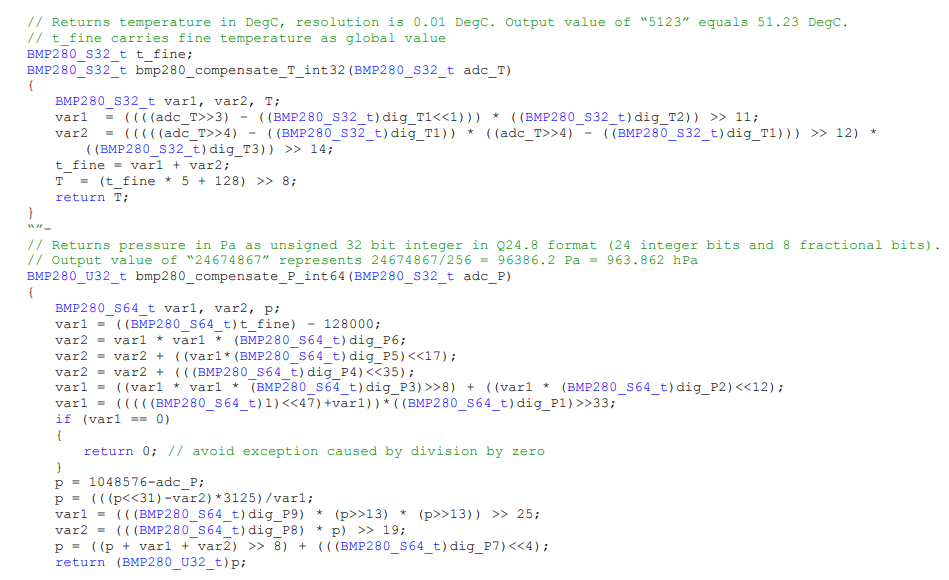
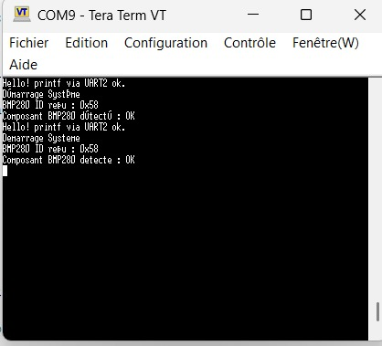
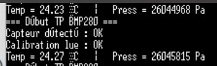
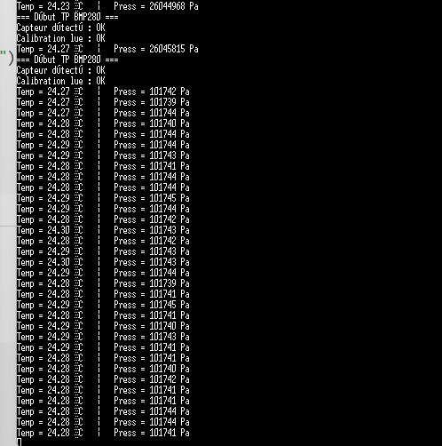

# 2526-ESE-TP_Bus-R-seau-Hajar_AIT_ALLA-Ikram_AFIF

# Réalisé par:
-Ikram AFIF

-Hajar AIT ALLA

# Objectif du TP

Ce TP a pour objectif la mise en place de l'ensemble des composants suivants:


# TP1 Capteur BMP280 (Bus I²C)

## 1. Quelles sont les adresses I²C possibles pour ce composant ?

Le BMP280 possède deux adresses I²C possibles selon le niveau logique de la broche SDO :

- `0x76` lorsque **SDO est reliée à la masse (GND)**
- `0x77` lorsque **SDO est reliée à la tension d’alimentation (VDDIO)**

---

## 2. Quel est le registre et la valeur permettant d’identifier ce composant ?

Le registre d’identification du BMP280 est :

- **Adresse du registre :** `0xD0`
- **Valeur attendue :** `0x58`

Cette valeur permet de vérifier que le capteur connecté est bien un BMP280.

---

## 3. Quel est le registre et la valeur permettant de placer le composant en mode normal ?

Le registre utilisé pour configurer le mode de fonctionnement est :

- **Nom du registre :** `ctrl_meas`
- **Adresse :** `0xF4`

Pour placer le capteur en **mode normal**.

Il faut écrire la valeur suivante :

- **Valeur :** `0x57` (`010 101 11` en binaire)

---

## 4. Quels sont les registres contenant l’étalonnage du composant ?

Les coefficients de calibration sont stockés dans les registres :

- **De l’adresse :** `0x88`
- **À l’adresse :** `0xA1`

---

## 5. Quels sont les registres contenant la température (ainsi que le format) ?

La température brute est codée sur **20 bits**, répartis sur trois registres :

| Registre   | Adresse | Bits utilisés |
|-----------|---------|---------------|
| temp_msb  | `0xFA`  | [19:12]       |
| temp_lsb  | `0xFB`  | [11:4]        |
| temp_xlsb | `0xFC`  | [3:0] (bits 7–4 du registre) |

Reconstruction de la valeur brute :

```c
adc_T = (temp_msb << 12) | (temp_lsb << 4) | (temp_xlsb >> 4);
```
## 6. Quels sont les registres contenant la pression (ainsi que le format) ?

La pression brute est codée sur **20 bits**, répartis sur trois registres :

| Registre    | Adresse | Bits utilisés |
|------------|---------|---------------|
| press_msb  | `0xF7`  | [19:12]       |
| press_lsb  | `0xF8`  | [11:4]        |
| press_xlsb | `0xF9`  | [3:0] (contenus dans les bits 7–4 du registre) |

La valeur brute de la pression est reconstruite comme suit :

```c
adc_P = (press_msb << 12) | (press_lsb << 4) | (press_xlsb >> 4);
```


## 7. les fonctions permettant le calcul de la température et de la pression compensées, en format entier 32 bits.



## Test de la chaîne de compilation et communication UART sur USB via printf


## Communication I²C

**Communication avec le BMP280**
- Identification du BMP280

```c

```
- Vérification à l'oscilloscope que la formes des trames I²C est conforme:


- Configuration du BMP280

```c

```


## Récupération de l'étalonnage, de la température et de la pression




## Calcul des températures et des pression compensées



